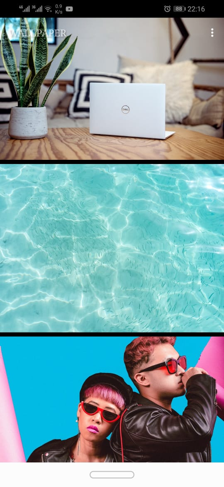
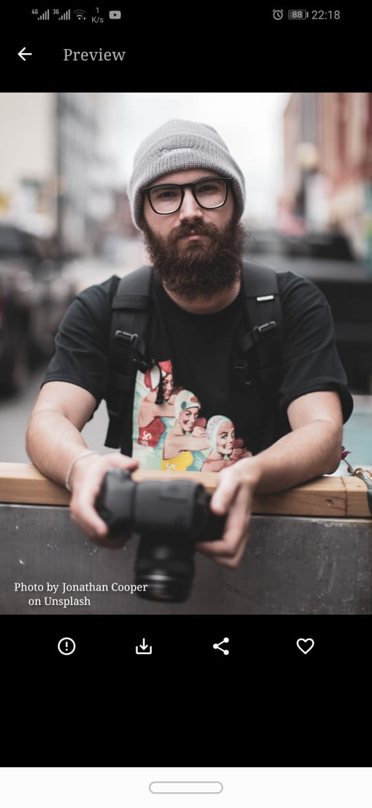
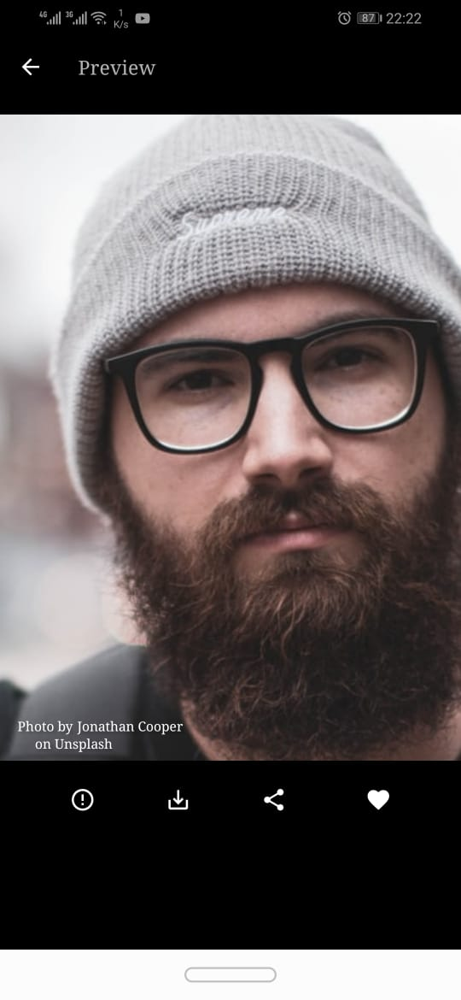
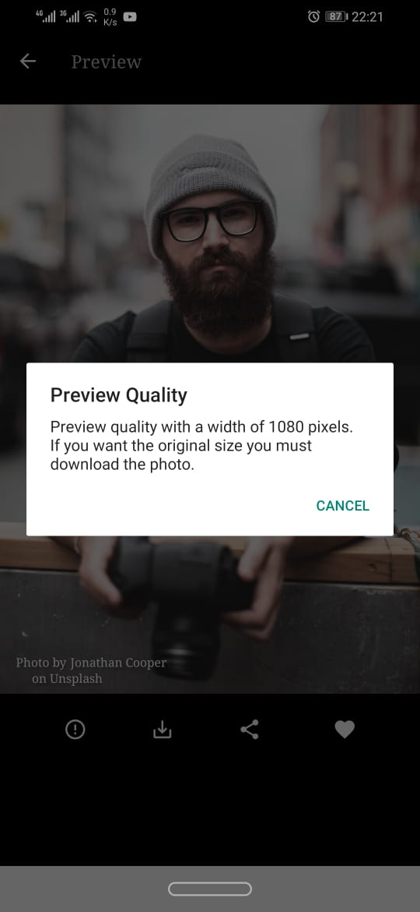
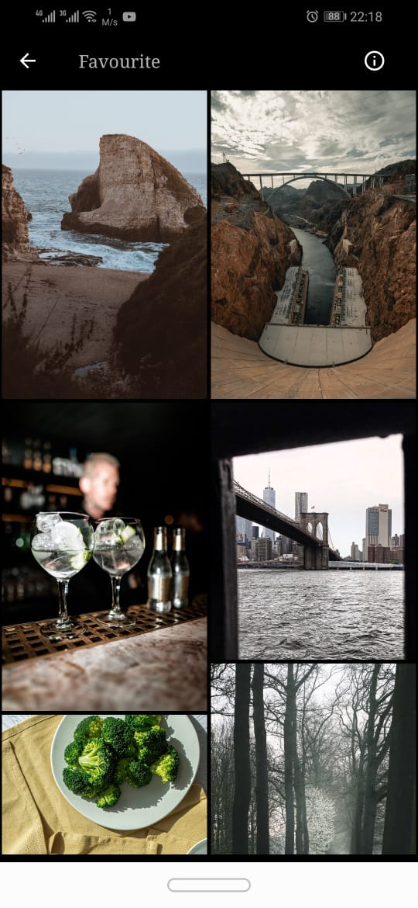
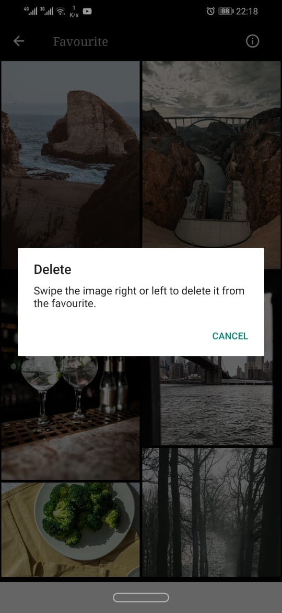
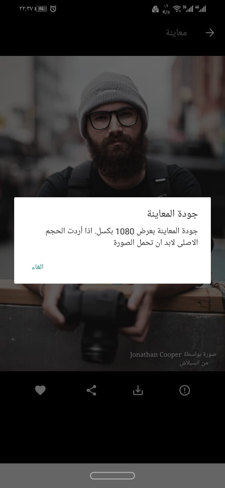

# Wallpaper android app


## Table of contents
* [General info](#general-info)
* [Screenshots](#screenshots)
* [Technologies](#technologies)
* [Features](#features) 
* [Setup](#setup)
* [YouTube Link](#youtube-link)
* [License](#license)


## General info
The main purpose of the app is downloading photos from the website directly instead of searching google on that website to start downloading, What I’m trying to say I make it easier for the user to download the photos from it via an application.


## Screenshots

  
 
 
 
 
 
 

## Technologies

#### Languages:
- Java 
- xml

#### Libraries:
- Retrofit 2.9.0 (https://square.github.io/retrofit/)
- Room 2.2.5 (https://developer.android.com/training/data-storage/room)
- Picasso 2.71828 (https://square.github.io/picasso/)
- Gson 2.8.5 (https://github.com/google/gson)
- RecyclerView 1.1.0 (https://developer.android.com/jetpack/androidx/releases/recyclerview)
- ButterKnife 10.2.1 (https://github.com/JakeWharton/butterknife)
- Google ads 19.4.0 (https://ads.google.com/home/)
- Google Analytics 17.5.0 (https://developers.google.com/analytics)
- Facebook Shimmer 0.4.0 (https://github.com/facebook/shimmer-android)


## Features
- Two languages included with app (Arabic and English).
- Widget inclucded too.
- High quality image after downloading it.
- Sample UI to use.

## Setup

To run this project, install it by download or clone.

#### Api key
- You need first to register new account in (https://unsplash.com/) to get an api key, 
Then embed it to the project to run the app.

#### System requirements
- Android studio v4.1.1
- Minimum sdk v21
- Build tool v29.0.3
- Compile sdk v29

## YouTube link 


(https://www.youtube.com/watch?v=paIYdSWFYIA)


## License

```html
MIT Licence 

Copyright (c) 2019 Ahmed Zaki

Permission is hereby granted, free of charge, to any person obtaining a copy of this software
and associated documentation files (the "Software"), to deal in the Software without restriction,
including without limitation the rights to use, copy, modify, merge, publish, distribute, sublicense,
and/or sell copies of the Software, and to permit persons to whom the Software is furnished to do so, 
subject to the following conditions:

The above copyright notice and this permission notice shall be included in all copies or substantial 
portions of the Software.

THE SOFTWARE IS PROVIDED "AS IS", WITHOUT WARRANTY OF ANY KIND, EXPRESS OR IMPLIED, 
INCLUDING BUT NOT LIMITED TO THE WARRANTIES OF MERCHANTABILITY, FITNESS FOR A PARTICULAR PURPOSE
AND NONINFRINGEMENT.IN NO EVENT SHALL THE AUTHORS OR COPYRIGHT HOLDERS BE LIABLE FOR ANY CLAIM,
DAMAGES OR OTHER LIABILITY, WHETHER IN AN ACTION OF CONTRACT,
TORT OR OTHERWISE, ARISING FROM, OUT OF OR IN CONNECTION WITH THE SOFTWARE
OR THE USE OR OTHER DEALINGS IN THE SOFTWARE.
```
